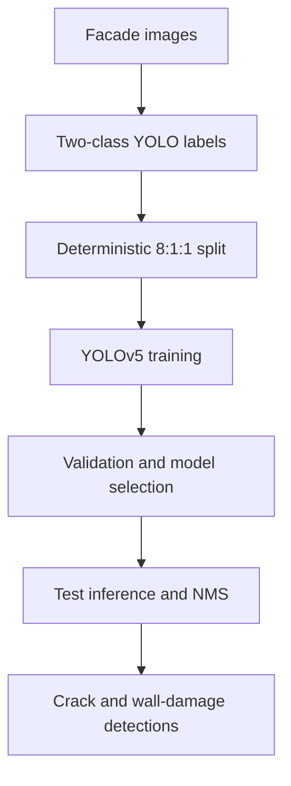

# Building Facade Disease Detection with YOLOv5

[](https://doi.org/10.1038/s41598-025-92112-7)
[](https://github.com/DrChenYou/Paper-1-Facade-Disease-Detection/actions/workflows/ci.yml)


Research companion repository for:

> You Chen and Dayao Li. **Disease detection on exterior surfaces of buildings using deep learning in China.** *Scientific Reports* 15, 8564 (2025). https://doi.org/10.1038/s41598-025-92112-7

This project turns the workflow described in the article into a clean, reusable YOLOv5 pipeline for detecting two types of facade defects:

- `cracks`
- `exterior_wall_damage`

## Research overview

The study combined 206 web-sourced images and 289 field images collected in Shenzhen, Shanwei, and Guangzhou, China. Images were labelled in YOLO format, augmented, and divided into training, validation, and test subsets at an 8:1:1 ratio. The published workflow used YOLOv5 for real-time facade-defect localisation and classification.



### Experimental configuration reported in the paper

| Item | Value |
| --- | --- |
| Total images described in Methods | 495 |
| Field-collected images | 289 |
| Web-sourced images | 206 |
| Classes | 2 |
| Split | 80% train / 10% validation / 10% test |
| Optimizer | Adam |
| Initial learning rate | 0.01 |
| Momentum | 0.937 |
| Weight decay | 0.0005 |
| Batch size | 16 |
| Epochs | 300 |
| Reported hardware | NVIDIA Tesla V100 32 GB |

### Published results

| Metric | Reported value |
| --- | ---: |
| Detection rate / precision (paper terminology) | 84.42% |
| Recall | 77.83% |
| F1 score | 0.81 |
| mAP@0.5 | 82.56% |
| Detection speed | 55 FPS |

## Repository structure

```text
.
|-- configs/                 # Dataset and hyperparameter configuration
|-- data/                    # Local-only images and labels (not committed)
|-- scripts/
|   |-- bootstrap_yolov5.py  # Fetches the pinned upstream YOLOv5 release
|   |-- prepare_dataset.py   # Validates and splits YOLO-format data
|   |-- train.py             # Reproducible training wrapper
|   |-- evaluate.py          # Test-set evaluation wrapper
|   `-- infer.py             # Image/video inference wrapper
|-- src/facade_damage/       # Dataset validation and metric utilities
|-- tests/                   # Lightweight automated tests
|-- DATASET.md               # Data layout, access, and ethics notes
`-- MODEL_CARD.md            # Intended use, limits, and reporting scope
```

## Quick start

### 1. Create the environment

```bash
conda env create -f environment.yml
conda activate facade-detection
pip install -e ".[dev]"
```

Alternatively, use a Python virtual environment and run:

```bash
pip install -e ".[dev]"
```

### 2. Add your authorised dataset

Place source images and YOLO labels in separate folders. Each image must have a label file with the same stem:

```text
my_data/
|-- images/
|   |-- facade_001.jpg
|   `-- facade_002.jpg
`-- labels/
    |-- facade_001.txt
    `-- facade_002.txt
```

Each label row follows `class_id x_center y_center width height`, with normalised coordinates. Class `0` is `cracks`; class `1` is `exterior_wall_damage`.

Prepare the deterministic 8:1:1 split:

```bash
python scripts/prepare_dataset.py \
  --images-dir my_data/images \
  --labels-dir my_data/labels \
  --output-dir data/processed \
  --seed 42
```

### 3. Install the pinned YOLOv5 baseline

```bash
python scripts/bootstrap_yolov5.py
pip install -r third_party/yolov5/requirements.txt
```

### 4. Train

```bash
python scripts/train.py \
  --yolov5-dir third_party/yolov5 \
  --data configs/building_disease.yaml
```

The wrapper uses the paper's documented settings: Adam, 300 epochs, batch size 16, initial learning rate 0.01, momentum 0.937, and weight decay 0.0005.

The default command uses YOLOv5s as an explicit baseline choice because the article does not unambiguously identify the released YOLOv5 scale. Augmentation types follow the paper, while unreported numerical augmentation coefficients are declared as baseline assumptions in `configs/hyp.building.yaml`.

### 5. Evaluate and infer

```bash
python scripts/evaluate.py \
  --yolov5-dir third_party/yolov5 \
  --weights runs/train/facade_yolov5s/weights/best.pt

python scripts/infer.py \
  --yolov5-dir third_party/yolov5 \
  --weights runs/train/facade_yolov5s/weights/best.pt \
  --source path/to/image_or_video
```

## Reproducibility scope

The article describes a YOLOv5-based detector and reports DenseNet/Swin-Transformer enhancements, but it does not provide a complete machine-readable model graph, trained weights, or all implementation details needed to reconstruct those architectural modifications exactly. Therefore:

1. the executable path in this repository reproduces the fully documented YOLOv5 training protocol;
2. it does **not** claim bit-for-bit reproduction of the unpublished original code;
3. paper metrics are labelled as reported results rather than newly reproduced results; and
4. the data manifest generated by `prepare_dataset.py` records every split assignment for auditability.

This distinction prevents accidental overclaiming and makes later release of the original model components straightforward.

## Tests

```bash
pytest -q
```

The test suite checks annotation parsing, coordinate ranges, deterministic splitting, and metric calculations without requiring a GPU.

## Data and weights

The paper states that relevant data are included in its Supporting Information and that further information may be requested from the first author subject to Universiti Sains Malaysia consent. See [DATASET.md](DATASET.md). No personal, copyrighted, or unauthorised field images should be committed to this repository.

## Citation

If this repository or the associated study supports your work, cite the article:

```bibtex
@article{chen2025facade,
  author  = {Chen, You and Li, Dayao},
  title   = {Disease detection on exterior surfaces of buildings using deep learning in China},
  journal = {Scientific Reports},
  volume  = {15},
  pages   = {8564},
  year    = {2025},
  doi     = {10.1038/s41598-025-92112-7}
}
```

GitHub's **Cite this repository** button is also supported through [CITATION.cff](CITATION.cff).

## License

- Original code in this repository: [MIT License](LICENSE).
- Published article: [CC BY-NC-ND 4.0](https://creativecommons.org/licenses/by-nc-nd/4.0/).
- YOLOv5: governed by the licence in the pinned upstream repository.
- Dataset and model weights: not licensed or redistributed by this repository.
